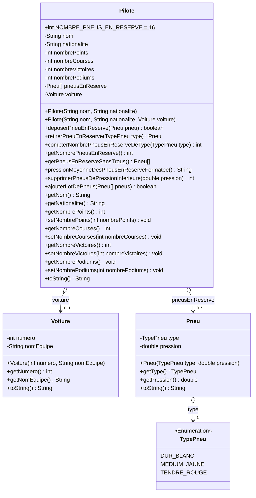

# E3-D400-FormulaOnnnne

## Durée : 180'

## Documents et sources autorisés

Pour les 3x classes (300211, 300212 et 300213) cette évaluation s'effectue :

- **sans réseau**
- **sans RP**
- **sans copilot ni aucune autre IA** (que ce soit en ligne, via une extension ou installée localement)
- uniquement avec Visual Studio Code et votre compréhension propre

**Vous n'êtes pas autorisés à consulter d'autres projets, d'autres exercices, d'autres formatives, ... durant l'évaluation.**

## Contexte général


La Formule 1 est un sport automobile de haut niveau où la logistique joue un rôle crucial. Les équipes doivent transporter de nombreux équipements comme les pneus et voitures.
Dans cet exercice, vous allez modéliser une partie de cette logistique : la gestion des pneus en réserve.

>[!WARNING]
>Commencez par lire cette consigne `avec grande attention` et prenez garde :
>
>- Les descriptions fonctionnelles sont précises et le choix des mots n'est pas anodin.
>- Faites les points mentionnés avec précision et dans l'ordre indiqué.
>- Revérifiez bien ensuite avoir fait ce qui est demandé.

## Diagrammes UML

### Diagrammes UML de classe

Voici un diagramme de classe UML pour modéliser les voitures, les pneus et les moteurs dans le contexte de la Formule 1 :



### Diagrammes UML de séquence

Voici un diagramme de classe qui représente la méthode `toString()` de la classe `Pilote` :

```mermaid
sequenceDiagram
    participant toString()
    participant voiture
    participant pneu
    toString()->>toString(): resultat = "Pilote: " + nom + " (" + nationalite + ")\n"
    alt s'il y a une voiture
        toString()->>voiture: getNomEquipe()
        voiture-->>toString(): nomEquipe
        toString()->>voiture: getNumero()
        voiture-->>toString(): numero
        toString()->>toString(): resultat += "-> Voiture " + nomEquipe + "(" + numero + ")\n"
        toString()->>toString(): resultat += "-> Points: " + nombrePoints + "\n"
        toString()->>toString(): resultat += "-> Courses: " + nombreCourses + "\n"
        toString()->>toString(): resultat += "-> Victoires: " + nombreVictoires + "\n"
        toString()->>toString(): resultat += "-> Podiums: " + nombrePodiums + "\n"
    else
        toString()->>toString(): resultat += "-> Pas de voiture assignée.\n"
    end
    loop pour chaque pneu dans pneusEnReserve
        alt s'il y a un pneu
            toString()->>pneu: getType()
            pneu-->>toString(): type
            toString()->>toString(): resultat += "-> Pneu en réserve: " + type + "\n"
        end
    end
    toString()->>toString(): return resultat
```

## JavaDoc

### Classe `Pneu.java`

Voici l'explication des méthodes de cette classe :

`public String toString()`

Faites qu'un pneu se représente sous forme de chaîne de caractères comme l'exemple suivant : 
- `Pneu [type=TENDRE_ROUGE, pression=2.0]`

Vous devez utiliser un formateur de nombre pour afficher la pression sous cette forme (0.0) avec le bon séparateur de décimales.

### Classe `Voiture.java`

Voici l'explication des méthodes de cette classe :

`public String toString()`

Faites qu'une voiture se représente sous forme de chaîne de caractères comme l'exemple suivant : 
- `Voiture N°016 de l'équipe Ferrari`
  
Vous devez utiliser un formateur de nombre pour afficher le numéro de la voiture sous cette forme (000).

Utiliser 

### Classe `Pilote.java`

Voici l'explication des méthodes de cette classe :

`public Pilote(String nom, String nationalite) {}`

Constructeur qui prépare un pilote sans voiture, sans aucun pneu en réserve, et avec toutes ses statistiques à zéro pour le moment (nbre de courses, ...).

`public Pilote(String nom, String nationalite, Voiture voiture) {}`

Constructeur qui prépare un pilote sans aucun pneu en réserve et avec toutes ses statistiques à zéro pour le moment (nbre de courses, ...).

`public boolean deposerPneuEnReserve(Pneu pneu) {}`

Tente de déposer un `pneu` en réserve. On peut déposer le `pneu` à n'importe quel endroit où se trouve un emplacement vide. La seule raison qui peut mener à l'échec d'un dépot est le manque de place.

`public Pneu retirerPneuEnReserve(TypePneu type) {}`

Retire un `pneu` d'un certain type de la réserve de pneus. Le premier pneu trouvé qui correspond à ce type sera retourné ou aucun s'il n'y en a pas.

`public int compterNombrePneusEnReserveDeType(TypePneu type) {}`

Compte le nombre de pneus se trouvant en réserve de ce type-là.

`public int getNombrePneusEnReserve() {}`

Compte le nombre de pneus se trouvant en réserve.

`public Pneu[] getPneusEnReserveSansTrous() {}`

Produit une liste des tous les pneus que la réserve contient, et ce bien entendu avec une liste sans "trous".

`public String pressionMoyenneDesPneusEnReserveFormatee() {}`

Produit une chaîne de caractères lisible et compréhensible contenant la pression moyenne de tous les pneus en réserve. Vous devez utiliser un formateur de nombre pour afficher la moyenne sous cette forme (0.00) avec le bon séparateur de décimales.

`public int supprimerPneusDePressionInferieure(double pression) {}`

Supprime tous les pneus ayant une pression inférieure à la pression fournie. Une fois fait, cette méthode retourne le nombre total de pneus ayant été suprimés.

`public boolean ajouterLotDePneus(Pneu[] pneus) {}`

Tenter d'ajouter tout un lot de pneus dans la réserve, en veillant aux points suivants :

- la liste de pneus fournie peut être grande et peut contenir des trous, et s'il y en a, seuls les pneus présents devront être ajoutés !
- tous ces pneus présents devront tous être ajoutés ou alors aucun. Il vous faudra donc **vérifier d'abord** disposer de la place nécessaire avant de le faire !

`public String toString()`

Voir diagramme UML correspondant.

## Tâches à effectuer

- Réaliser les classes ci-dessus dans le package `models` déjà présent.
- Implémenter ensuite toutes leurs méthodes. S'il ne s'agit pas d'un simple getter/setter, vous trouverez les indications nécessaires ci-dessus dans les javadocs fournies ou sous forme diagramme UML correspondant.
- Pour terminer, implémentez ensuite le code du `main()` permettant de créer un objet `Voiture` et ensuite un objet `Pilote` et d'afficher ses informations.
  
    ```text
    Etape 1 : Création d'une voiture de Formule 1, avec les caractéristiques suivantes :
     - numero = 16
     - nomEquipe = Ferrari

    Etape 2 : Création d'un pilote de Formule 1, avec les caractéristiques suivantes :
     - nom = Charles Leclerc
     - nationalité = Monégasque
     - voiture = (la voiture que vous avez créée à l'étape 1)
     - pneu en réserve = aucun
     - nombre de courses = 16
     - nombre de points = 65
     - nombre de victoires = 3
     - nombre de podiums = 7

    Etape 3 : Afficher le pilote sur la console

    Etape 4 : Tests des méthodes de la classe Pilote
    - créer un pneu de type DUR_BLANC et de pression 1.5
    - créer un pneu de type MEDIUM_JAUNE et de pression 1.8
    - créer un pneu de type TENDRE_ROUGE et de pression 2.0
    - créer un pneu de type DUR_BLANC et de pression 1.6
    - créer un pneu de type MEDIUM_JAUNE et de pression 1.7
    - deposerPneuEnReserve() : 5 fois avec les pneus ci-dessus
    - retirerPneuEnReserve() de type TENDRE_ROUGE et l'afficher !
    - getNombrePneusEnReserve() et afficher le nombre de pneus en réserve
    - getPneusEnReserveSansTrous() et afficher tous ces pneus en réserve reçus
    - pressionMoyenneDesPneusEnReserveFormatee() pour obtenir la pression moyenne et l'afficher
    - compterNombrePneusEnReserveDeType() et afficher le nombre de pneus en réserve de type DUR_BLANC
    - créer un pneu de type DUR_BLANC et de pression 1.3
    - créer un pneu de type DUR_BLANC et de pression 1.2
    - créer un pneu de type DUR_BLANC et de pression 1.1
    - créer un tableau avec ces 3 pneus
    - ajouter ce lot des 3 pneus d'un coup avec ajouterLotDePneus() et afficher si réussi ou si échec
    - supprimerPneusDePressionInferieure() à 1.4 et afficher le nombre de pneus qui ont réellement été supprimés
    ```

## Résultat sur la console

Si vous avez correctement réalisé cette application vous devriez obtenir un affichage ressemblant à ceci :

```text
Voiture N°016 de l'équipe 'Ferrari'
Pilote: Charles Leclerc (Monégasque)
-> Voiture Ferrari(16)
-> Points: 65
-> Courses: 16
-> Victoires: 3
-> Podiums: 7

Le pneu TENDRE_ROUGE qui a été retiré : Pneu [type=TENDRE_ROUGE, pression=2.0]
Nombre de pneus en réserve : 4
Pneus en réserve sans trous :
- DUR_BLANC avec pression 1.5
- MEDIUM_JAUNE avec pression 1.8
- DUR_BLANC avec pression 1.6
- MEDIUM_JAUNE avec pression 1.7
Pression moyenne des pneus en réserve : 1.65
Nombre de pneus en réserve de type DUR_BLANC : 2
Ajout du lot de pneus réussi :-)
Nombre de pneus supprimés de pression inférieure à 1.4 : 3
```

## RESTITUTION

Lorsque vous aurez terminé et que vous serez prêt à rendre :

1. Dans VSC **fermez tous les onglets ouverts** (afin de vous assurer que tous vos fichiers soient bien sauvegardés).
2. Zippez le dossier de ce projet que vous avez cloné en local
3. Faites signe au **prof qui viendra récupérer le fruit de votre travail sur sa clé USB**.
4. **Attendez qu'il vous donne l'autorisation de remettre le réseau !**
5. Sans attendre, faites un `commit/push` de votre travail comme enseigné afin de le rendre également sur Github/classroom.
6. **Attendez que le prof vous confirme avoir reçu votre repository sur classroom**
7. Fermez tout et quittez rapidement la salle en silence et en suivant les indications reçues pour ceux qui finiraient plus rapidement.
